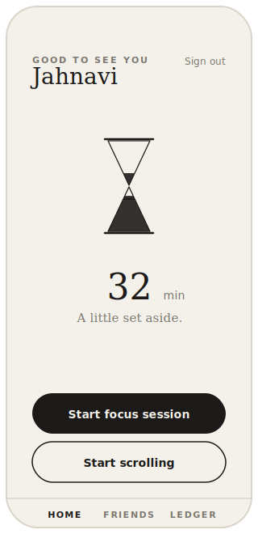
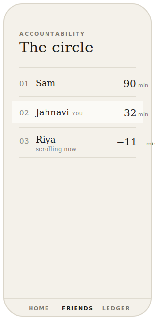
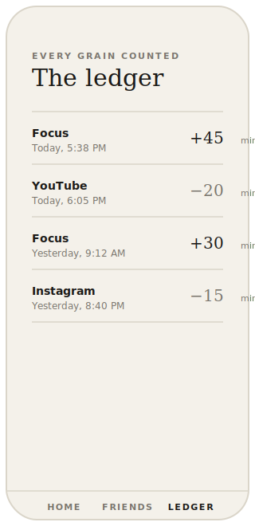
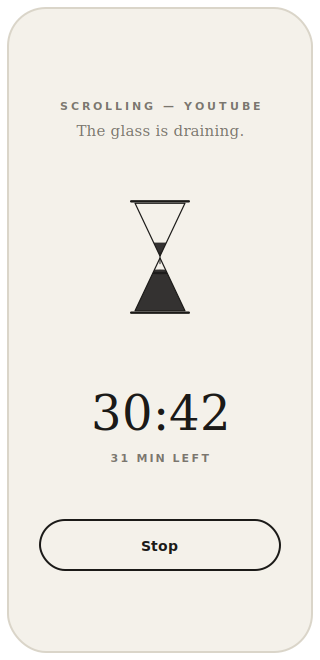

# ⧗ Hourglass

> Earn your scroll. Keep each other honest.

**Hourglass** is a small PWA for a friend group. You **earn time** by logging focus sessions, and **spend** that time to "unlock" scrolling sessions (Instagram / YouTube / Netflix). A hand-drawn hourglass fills as you focus and drains as you scroll, and your friends can see each other's balances live — social accountability without any hard blocking.

🔗 **Live app:** https://hourglass-olive.vercel.app

It's an **honor-system** tool (v1): nothing on your phone is actually blocked. The friction comes from the deliberate "spend" action, the draining hourglass, and your friends watching the leaderboard.

---

## Screens

| Home / Balance | Friends | Ledger (history) | Active session |
|:--:|:--:|:--:|:--:|
|  |  |  |  |

The three tabs (Home · Friends · Ledger) share a bottom navigation bar. Starting a session opens a full-screen timer — it turns **dark while you focus** (deep work) and stays **light while you scroll** (the glass draining in real time).

---

## ✦ Design

Chic, editorial monochrome — warm off-white paper (`#F4F1EA`), near-black ink (`#1B1A18`), [Fraunces](https://fonts.google.com/specimen/Fraunces) serif paired with [Inter](https://fonts.google.com/specimen/Inter), ruled "notebook" lists, and a minimal line-drawn hourglass. No color, no emoji — just type, hairlines, and whitespace.

---

## 🧩 Tech stack

| Layer | Choice | Why |
|---|---|---|
| Frontend | Plain HTML + CSS + vanilla JS | No build step. Open the file and it runs. |
| Styling | [Tailwind CSS](https://tailwindcss.com/) (CDN) + a little `styles.css` | Fast iteration, custom theme in-page. |
| Backend | [Supabase](https://supabase.com/) — Postgres + Auth + Realtime | Auth, a database, and live updates on the free tier. |
| Hosting | [Vercel](https://vercel.com/) static hosting | One-command deploys, great PWA support. |
| App shell | `manifest.json` + a network-first service worker | Installable, works offline-ish. |

There is **no bundler, no framework, no `npm install`** required to run the app. `npm` is only used to invoke the local static server and the Vercel CLI via `npx`.

---

## 📁 Project structure

```
hourglass/
├── index.html          # All four screens (auth, home, friends, ledger) + modals
├── app.js              # All logic: auth, sessions, balance, realtime, hourglass, timers
├── styles.css          # Animations + monochrome polish on top of Tailwind
├── config.js           # Supabase URL + publishable key (safe to commit — see Security)
├── manifest.json       # PWA manifest
├── sw.js               # Service worker (network-first, offline fallback)
├── supabase_setup.sql  # Run once in Supabase to create tables + RLS + realtime
├── icons/              # PWA icons (192 / 512 / 512-maskable)
├── docs/               # README screenshot mockups (SVG)
└── .claude/launch.json # Local dev server config (used by the preview tooling)
```

---

## 🧠 How it works (the important bits)

### Balance is *derived*, never stored
There is **no `balances` table**. A user's balance is always computed on the fly from their `sessions`:

```
balance = sum(focus durations) − sum(scroll durations)
```

A *running* session (where `ended_at` is null) is counted using elapsed time since `started_at`, so the number ticks live every second. This avoids an entire class of sync bugs — there's one source of truth (`sessions`) and everything else is a view over it. See `balanceFor()` in `app.js`.

### The hourglass
`setHourglass()` maps the balance to a fullness `0–1` (relative to `HOURGLASS_FULL_AT_MINUTES`, default 120) and moves the top/bottom sand rectangles inside two clipped SVG triangles. Sand and outlines use `currentColor`, so the same SVG renders ink-on-paper on the home screen and inverts to paper-on-ink in the dark focus overlay.

### Live friends leaderboard
On load the app subscribes to Postgres changes on the `sessions` table via Supabase Realtime. Any insert/update anywhere refetches and re-renders the leaderboard, and a 1-second tick keeps everyone's running balances ticking locally between events.

### Data model

```sql
profiles ( id → auth.users, display_name, created_at )
sessions ( id, user_id → auth.users, type 'focus'|'scroll',
           app_target 'instagram'|'youtube'|'netflix'|null,
           started_at, ended_at, duration_minutes, created_at )
```

Row-Level Security: any signed-in user can **read all** profiles/sessions (needed for the leaderboard), but can only **write their own** rows.

---

## 🚀 Run it locally

You only need [Node.js](https://nodejs.org/) (for the static server) and a browser.

```bash
git clone https://github.com/<your-username>/hourglass.git
cd hourglass

# serve the folder on http://localhost:5050
npx serve -l 5050 .
```

Then open http://localhost:5050. (Any static server works — `python -m http.server`, the VS Code "Live Server" extension, etc. You can't just `file://` open it because service workers and Supabase need an `http(s)` origin.)

---

## 🔧 First-time Supabase setup

If you're wiring this to a **fresh** Supabase project:

1. Create a project at [supabase.com](https://supabase.com/) → **Settings → API**, copy the **Project URL** and **publishable/anon key**.
2. Paste them into `config.js`:
   ```js
   window.HOURGLASS_CONFIG = {
     SUPABASE_URL: "https://YOUR-PROJECT.supabase.co",
     SUPABASE_ANON_KEY: "sb_publishable_...",
     HOURGLASS_FULL_AT_MINUTES: 120,
   };
   ```
3. In the SQL Editor, run the contents of [`supabase_setup.sql`](supabase_setup.sql) (creates tables, RLS policies, and enables realtime).
4. **Authentication → Sign In / Providers → Email:**
   - Enable the **Email** provider
   - Turn **Confirm email** *off* (so accounts work instantly)
   - Turn **Allow new users to sign up** *on*

That's the whole backend.

---

## ☁️ Deploy

The repo deploys as a static site on Vercel with zero config:

```bash
npx vercel --prod --yes
```

To get **automatic deploys on every push**, connect this GitHub repo in the Vercel dashboard (Project → Settings → Git) — then `git push` ships it.

---

## 📱 How to use

1. Open the live URL on your phone and **create an account** (pick a display name your friends will see).
2. **Install it:** Safari → Share → *Add to Home Screen*; Chrome → ⋮ → *Install app*.
3. Tap **Start focus session**, do your work, tap **Stop** — minutes are added to your balance.
4. Tap **Start scrolling**, pick the app — the glass drains in real time. At zero you get a friendly *"Sand's run out"* checkpoint (no enforcement).
5. Check the **Friends** tab to see everyone's balance update live.

---

## 🔒 Security note on `config.js`

The Supabase key in `config.js` is the **publishable / anon** key. It is *designed* to be shipped in frontend code and is safe to commit — it can only do what Row-Level Security allows (read all rows, write your own). It is **not** a service-role/secret key. If you ever need to rotate it, do so in the Supabase dashboard and update `config.js`.

---

## 🛣️ Roadmap (Phase 2, deliberately not in v1)

- Real OS-level enforcement: native **Android** (UsageStatsManager + Accessibility Service) and **iOS** (Screen Time / Family Controls) — separate native projects, not this PWA.
- A desktop **browser extension** as an interim enforcement step.
- Streaks, badges, weekly summaries, lending time to friends.

v1 is intentionally honor-system: it ships tonight, and generates real usage data to scope enforcement correctly.

---

## License

Personal project — do what you like with it.
